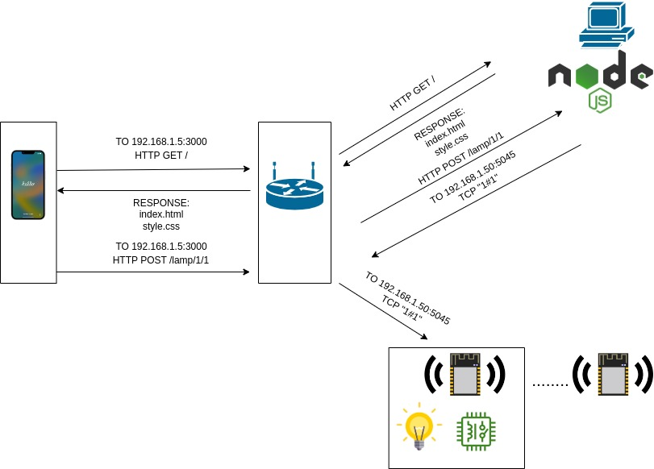

# SMART HOME SYSTEM USING NODE JS

## system up and running
https://user-images.githubusercontent.com/79010279/230731297-c81387a3-c3f4-4c51-b708-3c66e66f931b.mp4

### system diagram


## What to modify

### in the ESP source code (main.cpp)
```c++
// your home wifi network SSID
const char* ssid = "smartHome";
// Wifi network password
const char* password = "12345678";
// ESP listens on this port
const uint16_t socketNo = 5045;
```
### apply changes in app.js
```js
const ESP_port = 5045
const ESP_ip = '192.168.1.50'
```
### modify the server ip in static html page
```html
<script>
        const serverIp = '192.168.1.5'
</script>
```

# Start the server with following command 
```bash
# at src/webserver/
$ node app.js
```
